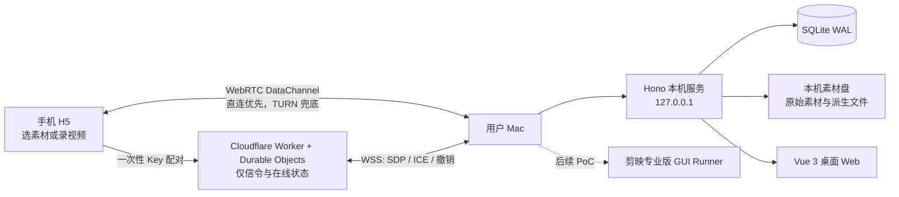

# 剪映自动剪辑

面向个人创作者的本机智能剪辑工具。它把项目、素材、声音样本、剪辑任务和成片留在用户自己的 Mac 上；手机只需打开一个极简 H5 页面，即可从外网选择多个文件或直接拍摄视频并上传到指定项目目录。

> 当前状态：本机素材入库与手机公网传输 PoC 已实现并通过自动化测试；剪映 GUI 全自动执行、TTS/声音克隆、图片/视频生成仍处于受控 PoC 或后续开发阶段，**不能视为已具备稳定自动出片能力**。

## 目标与边界

- 单用户、当前仅支持 macOS 作为本机工作站；PC 端以浏览器访问本机 Web。
- 首期内容类型：宠物、个人生活、探店 Vlog；默认使用 Vlog 工作流。
- 手机端只负责“选择素材 / 录制视频 / 上传”，支持 iOS 和 Android 浏览器；不承担剪辑、审核或成片浏览。
- 每个上传 Key 绑定一个项目、素材分类和手机可见目录名。一个项目/分类可签发多个 Key，手机可保存并切换已配对的目录。
- 素材字节通过 WebRTC DataChannel 直达 Mac；Cloudflare 只承担配对、在线状态、SDP/ICE 信令和短期 TURN 凭据签发，不保存素材。
- 本项目不上传素材、成片、声音样本、项目数据库或剪映工程到云端；云端 AI Provider 仅在用户单独配置、授权后才能使用。

## 架构概览



## 当前能力

### 已实现的入库基线

- 桌面 Web 创建“项目 + 素材分类”，再为一个手机目录生成一次性上传 Key。
- 移动 H5 通过 Key 获取并展示目标目录名；可添加多个 Key 并在目录间切换。
- 多文件并行上传、持久化队列、断点续传、SHA-256 校验、同卷暂存和原子提交。
- 手机直接调用摄像头录制，结束后自动进入上传队列。
- 无业务层单文件大小、批次总量或文件数量上限；准入只受实际磁盘空间、文件系统和 I/O 约束。
- SQLite 持久化上传状态，服务重启后可恢复未完成上传。
- 磁盘可用容量和未完成上传预留容量查询。
- STUN 优先；在 Cloudflare TURN 已配置时，本机经已认证 Worker 获取**短期** ICE 凭据，以支持受限 NAT/外网环境。

### 已确定、尚未完成的能力

- 每日增量、每周深度的素材整理；精确重复合并、近似重复推荐和回收站式删除策略。
- 长期风格：用户可为长期任务指定可复用的风格档案，不必每次提供参考视频。
- 参考视频/公开链接的结构化风格分析（不复制参考内容进入成片）。
- 本机优先的 TTS 与已授权声音克隆；可插拔图片/视频生成 Provider，未配置即不启用。
- 通过 macOS 上的剪映专业版 GUI Runner 完成剪辑和导出。该路线需要先通过独立兼容性与安全 PoC，详见[剪映 GUI 执行路线](docs/剪映GUI执行路线技术方案.md)。

## 仓库结构

```text
apps/
  client/             Vue 3 桌面控制台
  mobile-upload/      独立 Vue 3 移动上传 H5
  mobile-shell/       可选 Tauri 2 原生壳（iOS / Android）
  server/             Hono 本机控制面、SQLite 与 WebRTC 接收端
packages/
  contracts/          跨端 API、信令与传输契约
  domain/             上传准入等领域规则
workers/
  signaling/          Cloudflare 信令、配对与短期 TURN 凭据 Worker
docs/                 产品、架构、PoC 与部署文档
```

## 前置条件

- macOS（当前运行与剪映执行边界只针对 macOS）。
- Node.js 22：仓库固定版本见[`.nvmrc`](.nvmrc)。
- pnpm 10（建议通过 Corepack 管理）。
- 如需公网手机上传：一个 Cloudflare 账户；如网络需要 TURN 中继，还需 Cloudflare Realtime TURN 配置。
- 如需剪映自动化 PoC：当前 macOS 图形会话内安装并登录剪映专业版，且已完成辅助功能和屏幕录制权限授权。

## 本机快速开始

```sh
git clone https://github.com/lsiten/jianying-tools.git
cd jianying-tools
nvm use
corepack enable
pnpm install --frozen-lockfile
```

启动本机控制面：

```sh
pnpm dev:server
```

默认监听地址为 `http://127.0.0.1:31887`。可在另一个终端验证：

```sh
curl http://127.0.0.1:31887/health
curl http://127.0.0.1:31887/openapi.json
```

启动桌面 Web 开发服务器：

```sh
pnpm --filter @jianying/client dev
```

启动移动 H5 本地开发服务器：

```sh
pnpm --filter @jianying/mobile-upload dev
```

首次本机启动时，数据默认写入：

```text
~/Library/Application Support/JianyingAutoEditor/
├── state.sqlite
└── materials/
```

可在启动服务前设置 `JIANYING_DATA_DIRECTORY` 指向另一位置。请不要把真实配置、数据库、素材或任何凭据放入仓库；它们均已被[`.gitignore`](.gitignore)排除。

## 手机上传使用流程

1. 在桌面 Web 创建项目与素材分类。
2. 为对应手机目录签发 Key，填写手机应看到的目录名。
3. 打开移动上传 H5，粘贴 Key；页面会显示该 Key 的目标目录名。
4. 选择“选择素材”进行多文件上传，或选择“现在录制”拍摄视频；录制完成后自动进入上传队列。
5. 传输中可切换网络或暂时中断；下次回到页面会从已确认的位置继续。切换 Key 后，新文件会进入新目录，已有队列不会被改写。

Key 是能力凭据：仅在桌面 Web 创建时展示一次。泄露、遗失或不再使用时应立即撤销并重新创建，而不是把 Key 发到聊天记录、Issue、日志或 Git 仓库。

## 配置公网信令与 TURN

### 1. 配置 Cloudflare Worker

Worker 的部署说明在[workers/signaling/README.md](workers/signaling/README.md)。在部署前：

1. 检查 `workers/signaling/wrangler.jsonc` 中的 Worker 名称和路由。当前仓库的路由指向项目现有域名；若部署到自己的账号，先替换为自己的域名，或移除 `routes` 后使用 `workers.dev` 地址。
2. 通过 Wrangler 的交互式命令设置 `SIGNALING_HMAC_SECRET`，不要在 `.dev.vars`、Shell 历史、文档、截图或 Git 中保存真实值。
3. 如果要支持需要中继的网络，再交互式设置 `TURN_API_TOKEN` 和 `TURN_KEY_ID`。这两个 Cloudflare 长期值**只能**保存为 Worker Secret。
4. 构建移动 H5 并部署 Worker：

   ```sh
   pnpm --filter @jianying/mobile-upload build
   pnpm --filter @jianying/signaling-worker exec wrangler deploy
   ```

### 2. 配置本机服务

本机与 Worker 需要共享同一个 `SIGNALING_HMAC_SECRET`，用于认证本机请求。开发时可在当前终端以交互方式设置，避免值进入 Shell 历史：

```sh
read -rs JIANYING_SIGNALING_HMAC_SECRET
export JIANYING_SIGNALING_HMAC_SECRET
unset JIANYING_TURN_API_TOKEN JIANYING_TURN_KEY_ID
pnpm dev:server
```

可选环境变量：

| 变量 | 用途 | 默认值 |
| --- | --- | --- |
| `JIANYING_DATA_DIRECTORY` | 本机 SQLite 与素材根目录 | `~/Library/Application Support/JianyingAutoEditor` |
| `JIANYING_SERVER_PORT` | 本机 HTTP 控制面端口 | `31887` |
| `JIANYING_SIGNALING_HMAC_SECRET` | 与 Worker 一致的本机信令 HMAC | 未设置时公网传输不可用 |
| `JIANYING_SIGNALING_WORKER_URL` | Worker 基础地址 | 有 HMAC 时为 `https://upload.lene.fun`；自部署必须改为自己的地址 |
| `JIANYING_STUN_URLS` | 逗号分隔的 STUN URL | `stun:stun.cloudflare.com:3478` |
| `JIANYING_TURN_CREDENTIAL_TTL_SECONDS` | 会话级 TURN 凭据有效期 | `86400` 秒 |

`JIANYING_TURN_API_TOKEN` 与 `JIANYING_TURN_KEY_ID` 故意不受支持：本机服务检测到它们会拒绝启动配置。长期 TURN 凭据不应出现在 Mac 本机环境、移动 H5、Tauri 应用、日志或 Git 中。

## 安全与数据边界

- 本机 HTTP 服务只绑定 `127.0.0.1`，不将素材接收 API 直接暴露到公网。
- 上传 Key 的授权范围固定为目标项目/素材分类/目录，手机无法浏览或指定 Mac 上的任意路径。
- 素材通过 WebRTC 传输；Cloudflare Worker 不接收、不缓存、不持久化媒体字节。
- TURN 仅在网络受限时参与中继。TURN 可能按流量计费；系统不会静默改用 SFU、VPS、对象存储或任何云端素材中转。
- 云端仍可能按服务规则处理 WSS 内容、IP/端口、会话时间、ICE 候选与 TURN 计费元数据；使用前请自行确认 Cloudflare 的保留与计费政策。
- 原始素材不自动永久删除。未来整理策略仅自动清理可再生缓存与失败暂存；原始文件删除需进入回收站并由用户再次确认。

## 开发与验证

```sh
# 全部单元测试
pnpm test

# TypeScript / Vue 类型检查
pnpm typecheck

# Biome 静态检查
pnpm lint

# 自动格式化
pnpm format

# Worker 无远端资源的构建检查
pnpm --filter @jianying/signaling-worker exec wrangler deploy --dry-run
```

本机文件、移动浏览器、不同 NAT、锁屏/切后台、外置硬盘断开以及剪映 GUI 均须做真实环境验收；自动化测试不能替代这些验证。验收标准见[本机入库可靠性 PoC 验收清单](docs/本机入库可靠性PoC验收清单.md)与[剪映自动化 PoC 验收清单](docs/剪映自动化PoC验收清单.md)。

## 相关文档

- [产品方案对齐记录](docs/产品方案对齐记录.md)：已确认决策、范围和待讨论项。
- [技术架构与选型](docs/技术架构与选型.md)：完整技术基线与本机/云端职责。
- [本机公网入库技术方案](docs/本机公网入库技术方案.md)：配对、会话、断点续传、原子提交和安全边界。
- [首期免费部署方案](docs/首期免费部署方案.md)：本机 + Cloudflare 的部署边界与成本说明。
- [剪映 GUI 执行路线](docs/剪映GUI执行路线技术方案.md)：受控 GUI Agent、Action Gateway 与冻结闸门。
- [video-autopilot-kit 评估与复用边界](docs/video-autopilot-kit评估与复用边界.md)：外部项目仅作参考的边界。

## 贡献与提交安全

- 不提交 `.env`、`.dev.vars`、私钥/证书、数据库、素材、构建产物或 Cloudflare 凭据。
- 所有 PR/提交前至少执行 `pnpm test`、`pnpm typecheck`、`pnpm lint`，并检查 `git diff --check`。
- 严禁向 Issue、提交信息、测试快照、截图或日志粘贴上传 Key、HMAC、TURN Token、TURN Key ID、语音样本或真实素材路径。
- 剪映 GUI 自动化相关改动必须保留可审计的 PoC 证据，不得把未验证路径标记为“全自动可用”。

## 许可证

当前仓库尚未声明开源许可证。在获得明确授权前，请勿将其视为可自由再分发或商用的开源项目。
